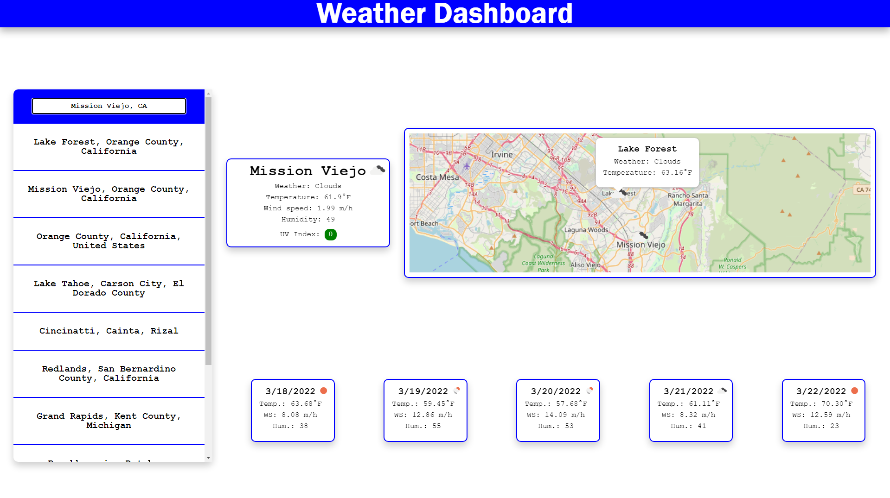

# Weather Dashboard

## Description

In this miniproject I use Javascript to obtain weather information from a user searched location (which are saved in local storage), and display it on a map as well as on text elements. I do this by using the OpenLayers library for the map, IPAPI for the user's current location, OpenStreetMaps API for the location search feature, and OpenWeather API for the weather information. When you hver over map items weather information is also displayed. I also display icons for the weather next to the weather information.

## Links

Website: https://benw10-1.github.io/weatherDashboard/ 
Repo: https://github.com/benw10-1/weatherDashboard

## Screenshots

